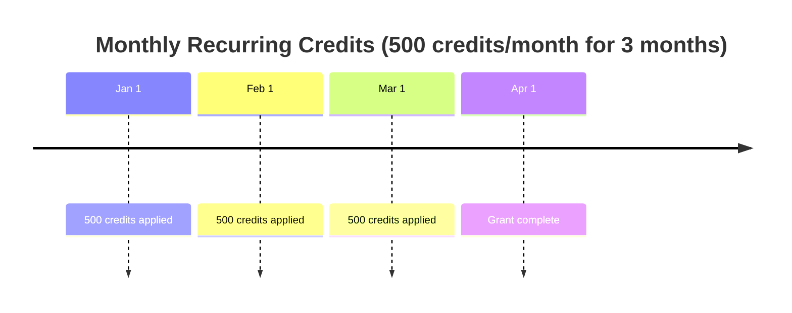

## Request Body

<ParamField body="name" type="string" required>
  Human-readable name for the credit grant (e.g., "Welcome Bonus", "Q1 2024 Credits")
</ParamField>

<ParamField body="scope" type="string" required>
  Scope of the credit grant
  
  **Values:**
  - `PLAN`: Credits apply to all subscriptions of a specific plan
  - `SUBSCRIPTION`: Credits apply to a specific subscription
</ParamField>

<ParamField body="plan_id" type="string">
  Required if `scope` is `PLAN`. The ID of the plan this grant applies to.
</ParamField>

<ParamField body="subscription_id" type="string">
  Required if `scope` is `SUBSCRIPTION`. The ID of the subscription this grant applies to.
</ParamField>

<ParamField body="credits" type="string" required>
  Number of credits to grant (must be greater than zero)
</ParamField>

<ParamField body="cadence" type="string" required>
  How credits are applied
  
  **Values:**
  - `ONETIME`: Credits are applied once
  - `RECURRING`: Credits are applied repeatedly based on period
</ParamField>

<ParamField body="period" type="string">
  Required if `cadence` is `RECURRING`. The recurring period.
  
  **Values:** `DAILY`, `WEEKLY`, `MONTHLY`, `QUARTERLY`, `YEARLY`
</ParamField>

<ParamField body="period_count" type="integer">
  Required if `cadence` is `RECURRING`. Number of periods for recurring grants (must be > 0)
</ParamField>

<ParamField body="expiration_type" type="string" required>
  How credits expire
  
  **Values:**
  - `NEVER`: Credits never expire
  - `DURATION`: Credits expire after a specific duration
  - `BILLING_CYCLE`: Credits expire at the end of the billing cycle
</ParamField>

<ParamField body="expiration_duration" type="integer">
  Required if `expiration_type` is `DURATION`. Duration before expiration (must be > 0)
</ParamField>

<ParamField body="expiration_duration_unit" type="string">
  Required if `expiration_type` is `DURATION`. Unit for expiration duration.
  
  **Values:** `DAYS`, `WEEKS`, `MONTHS`, `YEARS`
</ParamField>

<ParamField body="start_date" type="string">
  Required if `scope` is `SUBSCRIPTION`. Start date for the credit grant (ISO 8601 format)
  
  Not allowed for `PLAN`-scoped grants.
</ParamField>

<ParamField body="end_date" type="string">
  Optional for `SUBSCRIPTION` scope. End date for the credit grant (ISO 8601 format)
  
  Must be >= start_date if provided. Not allowed for `PLAN`-scoped grants.
</ParamField>

<ParamField body="conversion_rate" type="string">
  Conversion rate from credits to currency during consumption
  
  Example: If "2", then 1 credit = 0.5 currency units
</ParamField>

<ParamField body="topup_conversion_rate" type="string">
  Conversion rate for top-ups (e.g., how many credits per currency unit when loading)
</ParamField>

<ParamField body="priority" type="integer">
  Priority for credit consumption (lower number = higher priority)
  
  Credits with lower priority numbers are consumed first.
</ParamField>

<ParamField body="metadata" type="object">
  Custom metadata as key-value pairs
</ParamField>

## Response

<ResponseField name="id" type="string">
  Unique identifier for the credit grant
</ResponseField>

<ResponseField name="name" type="string">
  Name of the credit grant
</ResponseField>

<ResponseField name="scope" type="string">
  Scope of the grant (PLAN or SUBSCRIPTION)
</ResponseField>

<ResponseField name="plan_id" type="string">
  ID of the plan (if scope is PLAN)
</ResponseField>

<ResponseField name="subscription_id" type="string">
  ID of the subscription (if scope is SUBSCRIPTION)
</ResponseField>

<ResponseField name="credits" type="string">
  Number of credits granted
</ResponseField>

<ResponseField name="cadence" type="string">
  Cadence of the grant (ONETIME or RECURRING)
</ResponseField>

<ResponseField name="period" type="string">
  Period for recurring grants
</ResponseField>

<ResponseField name="period_count" type="integer">
  Number of periods for recurring grants
</ResponseField>

<ResponseField name="expiration_type" type="string">
  How credits expire (NEVER, DURATION, or BILLING_CYCLE)
</ResponseField>

<ResponseField name="expiration_duration" type="integer">
  Duration before expiration (if expiration_type is DURATION)
</ResponseField>

<ResponseField name="expiration_duration_unit" type="string">
  Unit for expiration duration
</ResponseField>

<ResponseField name="start_date" type="string">
  Start date for the grant (subscription-scoped only)
</ResponseField>

<ResponseField name="end_date" type="string">
  End date for the grant (subscription-scoped only)
</ResponseField>

<ResponseField name="conversion_rate" type="string">
  Conversion rate from credits to currency
</ResponseField>

<ResponseField name="topup_conversion_rate" type="string">
  Conversion rate for top-ups
</ResponseField>

<ResponseField name="priority" type="integer">
  Priority for credit consumption
</ResponseField>

<ResponseField name="metadata" type="object">
  Custom metadata
</ResponseField>

<ResponseField name="created_at" type="string">
  Timestamp when grant was created
</ResponseField>

<ResponseField name="updated_at" type="string">
  Timestamp when grant was last updated
</ResponseField>

<RequestExample>
```bash cURL - One-time promotional credits
curl -X POST "https://api.flexprice.io/v1/credit-grants" \
  -H "Authorization: Bearer YOUR_API_KEY" \
  -H "Content-Type: application/json" \
  -d '{
    "name": "Welcome Bonus",
    "scope": "SUBSCRIPTION",
    "subscription_id": "sub_1234",
    "credits": "100.00",
    "cadence": "ONETIME",
    "expiration_type": "DURATION",
    "expiration_duration": 30,
    "expiration_duration_unit": "DAYS",
    "start_date": "2024-01-15T00:00:00Z",
    "conversion_rate": "1",
    "priority": 1
  }'
```

```bash cURL - Recurring monthly credits
curl -X POST "https://api.flexprice.io/v1/credit-grants" \
  -H "Authorization: Bearer YOUR_API_KEY" \
  -H "Content-Type: application/json" \
  -d '{
    "name": "Monthly Plan Credits",
    "scope": "PLAN",
    "plan_id": "plan_enterprise",
    "credits": "500.00",
    "cadence": "RECURRING",
    "period": "MONTHLY",
    "period_count": 12,
    "expiration_type": "BILLING_CYCLE",
    "conversion_rate": "1"
  }'
```

```python Python
client = Flexprice(api_key="YOUR_API_KEY")

# One-time promotional credits
grant = client.credit_grants.create(
    name="Welcome Bonus",
    scope="SUBSCRIPTION",
    subscription_id="sub_1234",
    credits="100.00",
    cadence="ONETIME",
    expiration_type="DURATION",
    expiration_duration=30,
    expiration_duration_unit="DAYS",
    start_date="2024-01-15T00:00:00Z",
    conversion_rate="1",
    priority=1
)

# Recurring monthly credits
grant = client.credit_grants.create(
    name="Monthly Plan Credits",
    scope="PLAN",
    plan_id="plan_enterprise",
    credits="500.00",
    cadence="RECURRING",
    period="MONTHLY",
    period_count=12,
    expiration_type="BILLING_CYCLE",
    conversion_rate="1"
)
```

```typescript TypeScript
const client = new Flexprice({ apiKey: "YOUR_API_KEY" });

// One-time promotional credits
const grant = await client.creditGrants.create({
  name: "Welcome Bonus",
  scope: "SUBSCRIPTION",
  subscriptionId: "sub_1234",
  credits: "100.00",
  cadence: "ONETIME",
  expirationType: "DURATION",
  expirationDuration: 30,
  expirationDurationUnit: "DAYS",
  startDate: "2024-01-15T00:00:00Z",
  conversionRate: "1",
  priority: 1
});

// Recurring monthly credits
const grant = await client.creditGrants.create({
  name: "Monthly Plan Credits",
  scope: "PLAN",
  planId: "plan_enterprise",
  credits: "500.00",
  cadence: "RECURRING",
  period: "MONTHLY",
  periodCount: 12,
  expirationType: "BILLING_CYCLE",
  conversionRate: "1"
});
```

```go Go
client := flexprice.NewClient("YOUR_API_KEY")

// One-time promotional credits
grant, err := client.CreditGrants.Create(context.Background(), &flexprice.CreditGrantCreateParams{
    Name: "Welcome Bonus",
    Scope: "SUBSCRIPTION",
    SubscriptionID: "sub_1234",
    Credits: "100.00",
    Cadence: "ONETIME",
    ExpirationType: "DURATION",
    ExpirationDuration: 30,
    ExpirationDurationUnit: "DAYS",
    StartDate: time.Date(2024, 1, 15, 0, 0, 0, 0, time.UTC),
    ConversionRate: "1",
    Priority: 1,
})

// Recurring monthly credits
grant, err := client.CreditGrants.Create(context.Background(), &flexprice.CreditGrantCreateParams{
    Name: "Monthly Plan Credits",
    Scope: "PLAN",
    PlanID: "plan_enterprise",
    Credits: "500.00",
    Cadence: "RECURRING",
    Period: "MONTHLY",
    PeriodCount: 12,
    ExpirationType: "BILLING_CYCLE",
    ConversionRate: "1",
})
```
</RequestExample>

<ResponseExample>
```json 201
{
  "id": "cg_abc123xyz",
  "name": "Welcome Bonus",
  "scope": "SUBSCRIPTION",
  "subscription_id": "sub_1234",
  "credits": "100.00000000",
  "cadence": "ONETIME",
  "expiration_type": "DURATION",
  "expiration_duration": 30,
  "expiration_duration_unit": "DAYS",
  "start_date": "2024-01-15T00:00:00Z",
  "conversion_rate": "1.00000",
  "priority": 1,
  "metadata": {},
  "created_at": "2024-01-15T10:00:00Z",
  "updated_at": "2024-01-15T10:00:00Z"
}
```
</ResponseExample>

## Credit Grant Scopes

<AccordionGroup>
  <Accordion title="Plan-Scoped Credits">
    Credits granted at the plan level apply to all subscriptions using that plan.
    
    **Use cases:**
    - Included credits in a plan (e.g., "Enterprise plan includes 1000 API calls/month")
    - Plan-level promotions
    - Standard credit allotments
    
    **Characteristics:**
    - Automatically applied to new subscriptions
    - Cannot specify start/end dates (tied to subscription lifecycle)
    - Ideal for recurring credits that are part of the plan definition
  </Accordion>
  
  <Accordion title="Subscription-Scoped Credits">
    Credits granted to a specific subscription.
    
    **Use cases:**
    - One-time promotional credits for a customer
    - Compensation credits
    - Custom credit agreements
    - Trial period bonuses
    
    **Characteristics:**
    - Requires start_date
    - Optional end_date for time-limited grants
    - Applied only to the specified subscription
    - Flexible scheduling and expiration
  </Accordion>
</AccordionGroup>

## Expiration Types

<CardGroup cols={3}>
  <Card title="NEVER" icon="infinity">
    Credits never expire. Suitable for purchased credits or permanent grants.
  </Card>
  
  <Card title="DURATION" icon="clock">
    Credits expire after a specific duration (e.g., 30 days, 6 months).
  </Card>
  
  <Card title="BILLING_CYCLE" icon="calendar">
    Credits expire at the end of the current billing cycle. Common for monthly allowances.
  </Card>
</CardGroup>

## Recurring Credit Grants

Recurring credit grants automatically apply credits at regular intervals:



<Note>
  For recurring grants, FlexPrice automatically schedules credit applications. You don't need to manually create credits each period.
</Note>