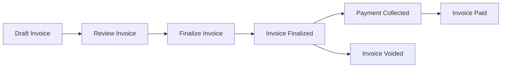

## Path Parameters

<ParamField path="id" type="string" required>
  The unique identifier of the invoice to finalize
</ParamField>

## What Happens When You Finalize an Invoice

Finalizing an invoice performs the following actions:

1. **Locks the invoice**: The invoice status changes from `DRAFT` to `FINALIZED`
2. **Freezes line items**: No further modifications can be made to line items or amounts
3. **Generates invoice number**: A human-readable invoice number is assigned (if not already present)
4. **Sets finalization timestamp**: The `finalized_at` timestamp is recorded
5. **Enables payment**: The invoice becomes eligible for payment processing

## Invoice Finalization Workflow



<Note>
  Once an invoice is finalized, it cannot be edited. Only payment status can change. If you need to modify a finalized invoice, you must void it and create a new one.
</Note>

<Warning>
  Finalization is irreversible. Ensure all line items, amounts, and customer information are correct before finalizing.
</Warning>

## Response

<ResponseField name="message" type="string">
  Confirmation message indicating successful finalization
</ResponseField>

<RequestExample>
```bash cURL
curl -X POST "https://api.flexprice.io/v1/invoices/inv_1234567890/finalize" \
  -H "Authorization: Bearer YOUR_API_KEY"
```

```python Python
client = Flexprice(api_key="YOUR_API_KEY")

result = client.invoices.finalize("inv_1234567890")
print(result.message)  # "invoice finalized successfully"
```

```typescript TypeScript
const client = new Flexprice({ apiKey: "YOUR_API_KEY" });

const result = await client.invoices.finalize("inv_1234567890");
console.log(result.message);  // "invoice finalized successfully"
```

```go Go
client := flexprice.NewClient("YOUR_API_KEY")

result, err := client.Invoices.Finalize(context.Background(), "inv_1234567890")
if err != nil {
    log.Fatal(err)
}
fmt.Println(result.Message)  // "invoice finalized successfully"
```
</RequestExample>

<ResponseExample>
```json 200 - Success
{
  "message": "invoice finalized successfully"
}
```

```json 400 - Already Finalized
{
  "error": {
    "code": "validation_error",
    "message": "Invoice is already finalized",
    "hint": "This invoice has already been finalized and cannot be finalized again"
  }
}
```

```json 400 - Invalid Status
{
  "error": {
    "code": "validation_error",
    "message": "Cannot finalize voided invoice",
    "hint": "Only draft invoices can be finalized"
  }
}
```

```json 404 - Not Found
{
  "error": {
    "code": "not_found",
    "message": "Invoice not found",
    "hint": "No invoice exists with the provided ID"
  }
}
```
</ResponseExample>

## After Finalization

Once an invoice is finalized, you can:

- **Collect payment**: Use the [Attempt Payment](/api/invoices/attempt-payment) endpoint to charge wallet credits
- **Update payment status**: Mark the invoice as paid via payment gateway integration
- **Void the invoice**: If needed, use the [Void Invoice](/api/invoices/void) endpoint
- **Send to customer**: Trigger invoice communication via webhook or email
- **Download PDF**: Generate and retrieve the invoice PDF

## Common Use Cases

<AccordionGroup>
  <Accordion title="Manual Invoice Review">
    For one-time invoices or complex billing scenarios, you may want to review draft invoices before finalizing them:
    
    1. Create invoice in draft status
    2. Review line items and amounts
    3. Make any necessary adjustments
    4. Finalize when ready
  </Accordion>
  
  <Accordion title="Subscription Billing">
    For automated subscription billing, invoices are typically finalized automatically:
    
    1. Billing cycle triggers invoice generation
    2. Invoice created and finalized in one step
    3. Payment collected automatically (if configured)
  </Accordion>
  
  <Accordion title="Usage-Based Billing">
    For metered billing, finalization marks the end of the usage collection period:
    
    1. Usage accumulated during billing period
    2. At period end, create draft invoice
    3. Verify usage calculations
    4. Finalize to lock usage amounts
  </Accordion>
</AccordionGroup>