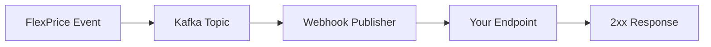

FlexPrice sends webhook events to notify your application when events happen in your account. Webhooks are particularly useful for asynchronous events like payment confirmations, subscription updates, and invoice status changes.

## How Webhooks Work

When an event occurs in FlexPrice:

1. FlexPrice creates a webhook event payload
2. The event is published to Kafka for reliable delivery
3. The webhook service delivers the event to your configured endpoint
4. Your application returns a 2xx status code to acknowledge receipt



## Webhook Events

FlexPrice supports the following webhook event types:

### Invoice Events

| Event Name | Description |
|------------|-------------|
| `invoice.create.drafted` | Invoice created in draft status |
| `invoice.update.finalized` | Invoice finalized and ready for payment |
| `invoice.update.payment` | Invoice payment status updated |
| `invoice.update.voided` | Invoice voided/cancelled |
| `invoice.update` | Invoice updated |
| `invoice.payment.overdue` | Invoice payment is overdue |
| `invoice.communication.triggered` | Invoice email/SMS sent |

### Subscription Events

| Event Name | Description |
|------------|-------------|
| `subscription.created` | New subscription created |
| `subscription.draft.created` | Subscription created in draft status |
| `subscription.activated` | Subscription activated |
| `subscription.updated` | Subscription details updated |
| `subscription.paused` | Subscription paused |
| `subscription.cancelled` | Subscription cancelled |
| `subscription.resumed` | Paused subscription resumed |
| `subscription.renewal.due` | Subscription renewal is due |

### Payment Events

| Event Name | Description |
|------------|-------------|
| `payment.created` | Payment record created |
| `payment.updated` | Payment details updated |
| `payment.success` | Payment succeeded |
| `payment.failed` | Payment failed |
| `payment.pending` | Payment pending processing |

### Customer Events

| Event Name | Description |
|------------|-------------|
| `customer.created` | New customer created |
| `customer.updated` | Customer details updated |
| `customer.deleted` | Customer deleted |

### Wallet Events

| Event Name | Description |
|------------|-------------|
| `wallet.created` | Wallet created for customer |
| `wallet.updated` | Wallet details updated |
| `wallet.terminated` | Wallet terminated |
| `wallet.transaction.created` | Wallet transaction recorded |
| `wallet.credit_balance.dropped` | Credit balance below threshold |
| `wallet.credit_balance.recovered` | Credit balance restored |
| `wallet.ongoing_balance.dropped` | Ongoing balance below threshold |
| `wallet.ongoing_balance.recovered` | Ongoing balance restored |

### Feature Events

| Event Name | Description |
|------------|-------------|
| `feature.created` | Feature created |
| `feature.updated` | Feature updated |
| `feature.deleted` | Feature deleted |
| `feature.wallet_balance.alert` | Feature usage threshold alert |

### Entitlement Events

| Event Name | Description |
|------------|-------------|
| `entitlement.created` | Customer entitlement granted |
| `entitlement.updated` | Entitlement updated |
| `entitlement.deleted` | Entitlement revoked |

### Credit Note Events

| Event Name | Description |
|------------|-------------|
| `credit_note.created` | Credit note issued |
| `credit_note.updated` | Credit note updated |

## Webhook Payload Structure

All webhook events follow this standard structure:

```json
{
  "id": "evt_...",
  "event_name": "invoice.update.finalized",
  "tenant_id": "tenant_...",
  "environment_id": "env_...",
  "user_id": "user_...",
  "timestamp": "2024-01-15T10:30:00Z",
  "payload": {
    // Event-specific data
  }
}
```

### Invoice Event Payload

<CodeGroup>
```json invoice.update.finalized
{
  "id": "evt_abc123",
  "event_name": "invoice.update.finalized",
  "tenant_id": "tenant_xyz",
  "environment_id": "env_prod",
  "timestamp": "2024-01-15T10:30:00Z",
  "payload": {
    "invoice": {
      "id": "inv_123",
      "invoice_number": "INV-2024-001",
      "customer_id": "cus_abc",
      "status": "finalized",
      "amount_due": 10000,
      "currency": "USD",
      "due_date": "2024-02-15T00:00:00Z",
      "line_items": [
        {
          "description": "Pro Plan - Monthly",
          "quantity": 1,
          "unit_amount": 10000,
          "amount": 10000
        }
      ]
    }
  }
}
```

```json payment.success
{
  "id": "evt_def456",
  "event_name": "payment.success",
  "tenant_id": "tenant_xyz",
  "environment_id": "env_prod",
  "timestamp": "2024-01-15T10:35:00Z",
  "payload": {
    "payment": {
      "id": "pay_789",
      "invoice_id": "inv_123",
      "customer_id": "cus_abc",
      "amount": 10000,
      "currency": "USD",
      "payment_status": "succeeded",
      "payment_method_type": "card",
      "gateway_payment_id": "pi_stripe_123",
      "paid_at": "2024-01-15T10:35:00Z"
    }
  }
}
```

```json subscription.created
{
  "id": "evt_ghi789",
  "event_name": "subscription.created",
  "tenant_id": "tenant_xyz",
  "environment_id": "env_prod",
  "timestamp": "2024-01-15T09:00:00Z",
  "payload": {
    "subscription": {
      "id": "sub_456",
      "customer_id": "cus_abc",
      "plan_id": "plan_pro",
      "status": "active",
      "current_period_start": "2024-01-15T00:00:00Z",
      "current_period_end": "2024-02-15T00:00:00Z",
      "billing_cycle": "monthly"
    }
  }
}
```
</CodeGroup>

## Configuration

### Create Webhook Endpoint

Configure a webhook endpoint to receive events:

```bash
curl -X POST https://api.flexprice.io/v1/webhook-endpoints \
  -H "Authorization: Bearer YOUR_API_KEY" \
  -H "Content-Type: application/json" \
  -d '{
    "url": "https://yourapp.com/webhooks/flexprice",
    "events": [
      "invoice.update.finalized",
      "payment.success",
      "payment.failed",
      "subscription.created"
    ],
    "enabled": true
  }'
```

### Event Filtering

Subscribe only to events you need:

<CodeGroup>
```bash All Invoice Events
curl -X POST https://api.flexprice.io/v1/webhook-endpoints \
  -H "Authorization: Bearer YOUR_API_KEY" \
  -H "Content-Type: application/json" \
  -d '{
    "url": "https://yourapp.com/webhooks",
    "events": [
      "invoice.create.drafted",
      "invoice.update.finalized",
      "invoice.update.payment",
      "invoice.update.voided",
      "invoice.payment.overdue"
    ]
  }'
```

```bash Payment Events Only
curl -X POST https://api.flexprice.io/v1/webhook-endpoints \
  -H "Authorization: Bearer YOUR_API_KEY" \
  -H "Content-Type: application/json" \
  -d '{
    "url": "https://yourapp.com/webhooks/payments",
    "events": [
      "payment.success",
      "payment.failed",
      "payment.pending"
    ]
  }'
```

```bash All Events
curl -X POST https://api.flexprice.io/v1/webhook-endpoints \
  -H "Authorization: Bearer YOUR_API_KEY" \
  -H "Content-Type: application/json" \
  -d '{
    "url": "https://yourapp.com/webhooks",
    "events": ["*"]
  }'
```
</CodeGroup>

## Implementation

### Basic Webhook Handler

<CodeGroup>
```typescript Node.js / Express
import express from 'express';
import { createHmac } from 'crypto';

const app = express();

app.post('/webhooks/flexprice', express.raw({ type: 'application/json' }), (req, res) => {
  const signature = req.headers['x-flexprice-signature'];
  const payload = req.body;
  
  // Verify webhook signature
  if (!verifySignature(payload, signature, process.env.WEBHOOK_SECRET)) {
    return res.status(401).send('Invalid signature');
  }
  
  const event = JSON.parse(payload);
  
  // Handle different event types
  switch (event.event_name) {
    case 'invoice.update.finalized':
      handleInvoiceFinalized(event.payload.invoice);
      break;
    case 'payment.success':
      handlePaymentSuccess(event.payload.payment);
      break;
    case 'subscription.created':
      handleSubscriptionCreated(event.payload.subscription);
      break;
    default:
      console.log(`Unhandled event: ${event.event_name}`);
  }
  
  res.status(200).send('OK');
});

function verifySignature(payload, signature, secret) {
  const hmac = createHmac('sha256', secret);
  hmac.update(payload);
  const expectedSignature = hmac.digest('hex');
  return signature === expectedSignature;
}
```

```python Python / Flask
from flask import Flask, request, jsonify
import hmac
import hashlib
import json

app = Flask(__name__)

@app.route('/webhooks/flexprice', methods=['POST'])
def webhook_handler():
    signature = request.headers.get('X-Flexprice-Signature')
    payload = request.get_data()
    
    # Verify webhook signature
    if not verify_signature(payload, signature, WEBHOOK_SECRET):
        return jsonify({'error': 'Invalid signature'}), 401
    
    event = json.loads(payload)
    
    # Handle different event types
    event_name = event['event_name']
    if event_name == 'invoice.update.finalized':
        handle_invoice_finalized(event['payload']['invoice'])
    elif event_name == 'payment.success':
        handle_payment_success(event['payload']['payment'])
    elif event_name == 'subscription.created':
        handle_subscription_created(event['payload']['subscription'])
    else:
        print(f'Unhandled event: {event_name}')
    
    return jsonify({'status': 'ok'}), 200

def verify_signature(payload, signature, secret):
    expected = hmac.new(
        secret.encode(),
        payload,
        hashlib.sha256
    ).hexdigest()
    return hmac.compare_digest(signature, expected)
```

```go Go
package main

import (
    "crypto/hmac"
    "crypto/sha256"
    "encoding/hex"
    "encoding/json"
    "io"
    "net/http"
)

type WebhookEvent struct {
    ID            string          `json:"id"`
    EventName     string          `json:"event_name"`
    TenantID      string          `json:"tenant_id"`
    EnvironmentID string          `json:"environment_id"`
    Timestamp     string          `json:"timestamp"`
    Payload       json.RawMessage `json:"payload"`
}

func webhookHandler(w http.ResponseWriter, r *http.Request) {
    signature := r.Header.Get("X-Flexprice-Signature")
    payload, _ := io.ReadAll(r.Body)
    
    // Verify webhook signature
    if !verifySignature(payload, signature, webhookSecret) {
        http.Error(w, "Invalid signature", http.StatusUnauthorized)
        return
    }
    
    var event WebhookEvent
    json.Unmarshal(payload, &event)
    
    // Handle different event types
    switch event.EventName {
    case "invoice.update.finalized":
        handleInvoiceFinalized(event.Payload)
    case "payment.success":
        handlePaymentSuccess(event.Payload)
    case "subscription.created":
        handleSubscriptionCreated(event.Payload)
    default:
        log.Printf("Unhandled event: %s", event.EventName)
    }
    
    w.WriteHeader(http.StatusOK)
}

func verifySignature(payload []byte, signature, secret string) bool {
    mac := hmac.New(sha256.New, []byte(secret))
    mac.Write(payload)
    expected := hex.EncodeToString(mac.Sum(nil))
    return hmac.Equal([]byte(signature), []byte(expected))
}
```
</CodeGroup>

## Security

### Signature Verification

All webhook requests include an `X-Flexprice-Signature` header for verification:

<Steps>
  <Step title="Extract Signature">
    Get the `X-Flexprice-Signature` header from the request
  </Step>
  
  <Step title="Compute HMAC">
    Create an HMAC SHA-256 hash of the raw request body using your webhook secret
  </Step>
  
  <Step title="Compare">
    Use constant-time comparison to match the computed hash with the signature header
  </Step>
</Steps>

<Warning>
  Always verify webhook signatures before processing events to prevent unauthorized requests.
</Warning>

### Best Practices

- **Use HTTPS** - Only accept webhooks over HTTPS endpoints
- **Verify Signatures** - Always validate the webhook signature
- **Use Constant-Time Comparison** - Prevent timing attacks when comparing signatures
- **Idempotency** - Handle duplicate webhook deliveries gracefully
- **Async Processing** - Process webhooks asynchronously to avoid timeouts
- **Error Handling** - Return 2xx status codes even if processing fails internally

## Webhook Architecture

FlexPrice's webhook system uses Kafka for reliable delivery:

```go
// Webhook publisher publishes to Kafka
type WebhookPublisher interface {
    Publish(ctx context.Context, event *types.WebhookEvent) error
}

// Webhook payload factory creates event-specific payloads
type PayloadBuilderFactory interface {
    GetBuilder(eventType string) (PayloadBuilder, error)
}

// Registered webhook event builders
builders := map[string]PayloadBuilder{
    "invoice.update.finalized":  NewInvoicePayloadBuilder(),
    "payment.success":           NewPaymentPayloadBuilder(),
    "subscription.created":      NewSubscriptionPayloadBuilder(),
    "customer.created":          NewCustomerPayloadBuilder(),
    "wallet.transaction.created": NewTransactionPayloadBuilder(),
    // ... all other event types
}
```

## Testing

### Test Webhook Locally

Use tools like ngrok to expose your local server:

```bash
# Start ngrok
ngrok http 3000

# Configure webhook endpoint with ngrok URL
curl -X POST https://api.flexprice.io/v1/webhook-endpoints \
  -H "Authorization: Bearer YOUR_API_KEY" \
  -d '{
    "url": "https://abc123.ngrok.io/webhooks",
    "events": ["*"]
  }'
```

### Trigger Test Events

Create test events to verify your webhook handler:

```bash
curl -X POST https://api.flexprice.io/v1/webhook-endpoints/{endpoint_id}/test \
  -H "Authorization: Bearer YOUR_API_KEY" \
  -H "Content-Type: application/json" \
  -d '{
    "event_name": "invoice.update.finalized"
  }'
```

## Monitoring

### View Webhook Deliveries

Check webhook delivery status and logs:

```bash
curl -X GET https://api.flexprice.io/v1/webhook-endpoints/{endpoint_id}/deliveries \
  -H "Authorization: Bearer YOUR_API_KEY"
```

**Response:**

```json
{
  "deliveries": [
    {
      "id": "del_123",
      "event_id": "evt_abc",
      "event_name": "invoice.update.finalized",
      "status": "succeeded",
      "response_code": 200,
      "attempted_at": "2024-01-15T10:30:00Z"
    },
    {
      "id": "del_124",
      "event_id": "evt_def",
      "event_name": "payment.success",
      "status": "failed",
      "response_code": 500,
      "error": "Internal server error",
      "attempted_at": "2024-01-15T10:35:00Z",
      "retry_at": "2024-01-15T10:40:00Z"
    }
  ]
}
```

## Troubleshooting

### Common Issues

<AccordionGroup>
  <Accordion title="Webhook not received">
    - Verify endpoint URL is publicly accessible
    - Check firewall rules allow FlexPrice IPs
    - Ensure endpoint returns 2xx status code
    - Verify webhook endpoint is enabled
  </Accordion>
  
  <Accordion title="Signature verification fails">
    - Use raw request body (don't parse JSON first)
    - Verify webhook secret is correct
    - Use constant-time comparison
    - Check for encoding issues
  </Accordion>
  
  <Accordion title="Missing events">
    - Check event subscription configuration
    - Verify webhook endpoint is active
    - Review delivery logs for failures
    - Check for rate limiting on your endpoint
  </Accordion>
  
  <Accordion title="Duplicate events">
    - Implement idempotency using event.id
    - Track processed event IDs
    - Return 2xx even if already processed
  </Accordion>
</AccordionGroup>

## Next Steps

<CardGroup cols={2}>
  <Card title="Stripe Integration" icon="stripe" href="/integrations/stripe">
    Configure Stripe integration
  </Card>
  <Card title="API Reference" icon="code" href="/api-reference">
    Explore webhook endpoint API
  </Card>
</CardGroup>
