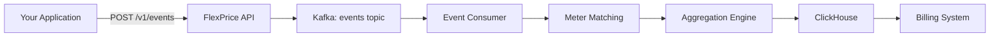

FlexPrice's metering system captures, aggregates, and tracks customer usage in real-time. It forms the foundation of usage-based billing by transforming raw events into billable metrics.

## Architecture

The metering system consists of three core components:

<Steps>
  <Step title="Event Ingestion">
    Raw usage events are sent to FlexPrice via HTTP API and queued in Kafka topics for asynchronous processing.
  </Step>
  
  <Step title="Meter Matching & Aggregation">
    Events are matched against meter configurations and aggregated according to defined rules (sum, count, max, etc.).
  </Step>
  
  <Step title="Usage Storage & Querying">
    Aggregated usage is stored in ClickHouse for fast time-series analytics and billing calculations.
  </Step>
</Steps>

## How It Works

### Event Flow



### Processing Pipeline

1. **Ingestion**: Events are accepted via API and immediately acknowledged (HTTP 202)
2. **Asynchronous Processing**: Events are consumed from Kafka and processed in batches
3. **Customer Resolution**: External customer IDs are resolved to internal FlexPrice customer records
4. **Meter Matching**: Events are matched against active meters based on `event_name` and filters
5. **Aggregation**: Matched events are aggregated according to meter configuration
6. **Storage**: Processed usage is stored in ClickHouse for querying and billing

## Key Concepts

### Events

An **event** is a single occurrence of measurable activity in your system:

<CodeGroup>
```json API Request Event
{
  "event_name": "api_request",
  "external_customer_id": "customer_123",
  "timestamp": "2024-03-20T15:04:05Z",
  "properties": {
    "endpoint": "/api/v1/users",
    "method": "GET",
    "response_time_ms": 45,
    "status_code": 200
  }
}
```

```json Storage Event
{
  "event_name": "storage_used",
  "external_customer_id": "customer_123",
  "timestamp": "2024-03-20T15:04:05Z",
  "properties": {
    "bytes": 1073741824,
    "region": "us-west-2",
    "storage_class": "standard"
  }
}
```

```json Compute Event
{
  "event_name": "compute_usage",
  "external_customer_id": "customer_123",
  "timestamp": "2024-03-20T15:04:05Z",
  "properties": {
    "duration_seconds": 300,
    "cpu_cores": 4,
    "memory_gb": 16
  }
}
```
</CodeGroup>

### Meters

A **meter** defines how to measure and aggregate events into billable usage:

- **Event Name**: Which events to track (e.g., `api_request`)
- **Aggregation**: How to calculate usage (COUNT, SUM, MAX, etc.)
- **Filters**: Optional criteria to match specific events
- **Reset Behavior**: When to reset accumulated usage

### Usage Aggregation

**Aggregated usage** is the computed metric that feeds into billing:

- Calculated over time windows (hour, day, month)
- Supports multiple aggregation methods
- Can be grouped by custom properties
- Stored efficiently for fast queries

## Kafka Topics

FlexPrice uses Kafka for asynchronous event processing:

| Topic | Purpose | Consumer |
|-------|---------|----------|
| `events` | Raw event ingestion | Event Consumer |
| `events_lazy` | Deferred/batch processing | Lazy Event Consumer |
| `events_post_processing` | Post-processing pipeline | Post-processor |
| `system_events` | Internal system events & webhooks | System Event Handler |

<Note>
Kafka topics are configured with `replication_factor=1` and `auto_create=false` in development. Production deployments should use higher replication factors for durability.
</Note>

## Data Storage

### ClickHouse Tables

FlexPrice uses ClickHouse for high-performance event storage:

- **`events`**: Raw ingested events
- **`feature_usage`**: Processed usage per feature/meter
- **`cost_usage`**: Cost calculations for billing
- **`raw_events`**: Original event payloads for reprocessing

### Retention & Performance

- Events are stored indefinitely by default
- ClickHouse's columnar storage provides sub-second queries over billions of events
- Partition by month for optimal query performance
- Supports real-time queries during active billing periods

## Multi-Tenancy & Environments

All events and usage data are scoped by:

- **Tenant ID**: Isolates data between organizations
- **Environment ID**: Separates production, staging, and development data

Every API request must include valid credentials that map to a specific tenant and environment.

## Common Use Cases

### API Metering

Track API calls per customer:

- **Event**: `api_request`
- **Aggregation**: COUNT
- **Filters**: None (count all requests)
- **Reset**: Monthly (per billing period)

### Storage Metering

Measure storage consumption:

- **Event**: `storage_snapshot`
- **Aggregation**: MAX (peak storage in period)
- **Filters**: By region or storage class
- **Reset**: None (continuous measurement)

### Compute Metering

Bill for compute resources:

- **Event**: `compute_usage`
- **Aggregation**: SUM of `duration_seconds * cpu_cores`
- **Filters**: By instance type
- **Reset**: Monthly

### Seat-Based Metering

Count active users:

- **Event**: `user_activity`
- **Aggregation**: COUNT_UNIQUE on `user_id`
- **Filters**: None
- **Reset**: Monthly

## Next Steps

<CardGroup cols={2}>
  <Card title="Event Ingestion" icon="upload" href="/metering/events">
    Learn how to send events to FlexPrice
  </Card>
  
  <Card title="Meter Configuration" icon="gauge" href="/metering/meters">
    Create and configure meters
  </Card>
  
  <Card title="Aggregation Methods" icon="calculator" href="/metering/aggregations">
    Understand aggregation types
  </Card>
  
  <Card title="Query Usage" icon="chart-line" href="/api/events/query">
    Retrieve usage data via API
  </Card>
</CardGroup>